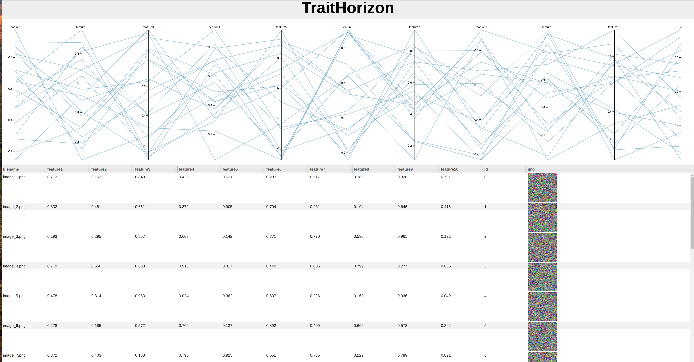

# TraitHorizon

**TraitHorizon** is a Flask application designed for visualizing images alongside arbitrary numerical features. It allows you to explore and interact with image data through an intuitive user interface, providing both parallel coordinate plots and a data table for exploration.


## Prerequisites

Before using the Image Features Viewer, ensure you have the following components installed:

- Python 3.x
- Flask

## Installation

1. Clone or download the repository containing TraitHorizon.

2. Install the required Python packages using the following command:

    ```bash
    pip install Flask
    ```

## Usage

To use the Image Features Viewer tool, follow these steps:

1. Open a terminal window and navigate to the cloned TraitHorizon repository.

2. Run the application by executing the following command:

    ```bash
    python ./ path_to_assets_folder path_to_tsv_file
    ```

    Run the following command to try TraitHorizon with our toy example:
    ```bash
    python ./ example_imgs example.tsv
    ```

3. Once the application is running, open a web browser and go to the provided URL (usually `http://127.0.0.1:5000/`).

## Features

### Parallel Coordinate Plot

The Image Features Viewer provides a parallel coordinate plot that displays the relationship between numerical features of the images. Each line in the plot represents an image, and you can interact with it to filter and explore the data.

### Data Table

The data table displays the image filenames, thumbnails, and corresponding numerical feature values. You can perform the following actions with the data table:

- Sort data by clicking on the column headers.
- Navigate through pages using pagination controls.

## Contributions

Contributions to the Image Features Viewer tool are welcome. Feel free to fork the repository, make improvements, and submit pull requests.

## License

This tool is provided under the [MIT License](https://opensource.org/licenses/MIT).
