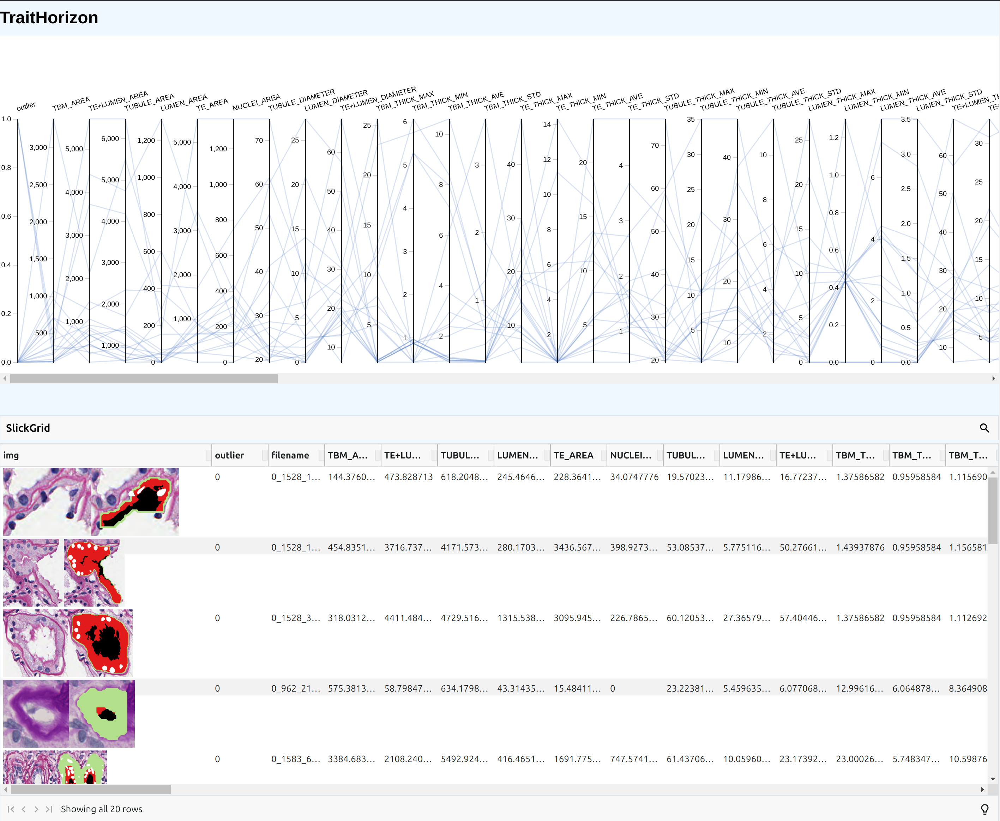

# TraitHorizon

**TraitHorizon** is a Flask application designed for visualizing images alongside arbitrary numerical features. It combines a parallel coordinate plot with a data table to provide an interactive interface for exploring your data.

Researchers and pathologists may find TraitHorizon useful for exploring digital pathology datasets, which can contain hundreds of thousands of histologic objects (e.g., renal tubules) paired with high-dimensional feature vectors. An example use case is presented in the corresponding [JOSS paper](paper/paper.pdf)

## Documentation
The official documentation for TraitHorizon can be found here:
[TraitHorizon Documentation](https://traithorizon.readthedocs.io/en/latest/).

## Community Guidelines
If you encounter a bug or have a feature request, please open an issue on [GitHub Issues](../../issues). Contributions are welcome via [Pull Requests](../../pulls)—please be respectful and constructive in your interactions with others.

## License
This project is licensed under The Clear BSD License. See the [LICENSE](LICENSE.txt) file for details.