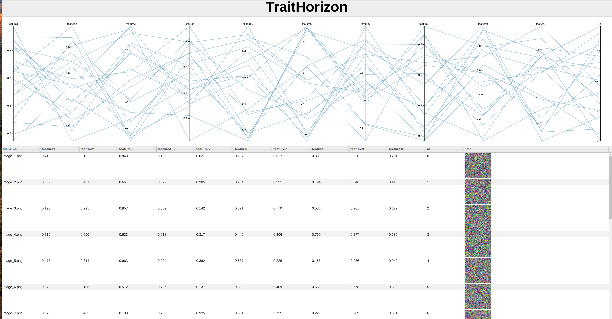

Welcome to TraitHorizon's Documentation!
=========================================

**TraitHorizon** is a Flask application designed for visualizing images alongside arbitrary numerical features. It combines a parallel coordinate plot with a data table to provide an interactive interface for exploring your data.

Key Features
------------

- Visualize images with associated numerical features.
- Interactive parallel coordinate plots for feature exploration.
- Support for data with image URLs.

Contributing
------------

Contributions are welcome! Feel free to fork the repository, make improvements, and submit pull requests.

License
-------

TraitHorizon is provided under the `MIT License <https://opensource.org/licenses/MIT>`_.

.. toctree::
   :maxdepth: 2
   :caption: Contents:

   installation
   usage
   api
   unit_testing
