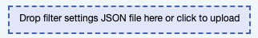

# User Guide

This document provides instructions for using traithorizon.

## Command Line Interface (CLI)

```{note}
If you are running the app behind a reverse proxy (e.g., Nginx), you may need to set the `--reverse_proxy` flag. 
This ensures that the app correctly handles forwarded headers and URL paths.
```

```
$ traithorizon --help

usage: traithorizon [-h] [--reverse_proxy] [--hide_axes HIDE_AXES [HIDE_AXES ...]] assets_path tsv_path

A web application for visualizing images with arbitrary numerical features.

positional arguments:
assets_path           The path of the folder containing image files.
tsv_path              The path of the tsv file. Each row should start with a filename (image1.png) cell,
                        followed by a cell for each feature.

options:
-h, --help            show this help message and exit
--reverse_proxy       Set this flag if the app is behind a reverse proxy.
--hide_axes HIDE_AXES [HIDE_AXES ...]
                        Axes to hide from the parallel coordinates plot in addition to 'filename', 'img',
                        and 'url'.
```

## Usage Example
The following command will run TraitHorizon with example data.
```bash
traithorizon examples/imgs examples/tubule_example.tsv
```

Video demo:
<iframe width="100%" height="500" src="https://www.youtube.com/embed/sk-AHsd7A2g?si=7akaAAG6UeEyBOwp" title="YouTube video player" frameborder="0" allow="accelerometer; autoplay; clipboard-write; encrypted-media; gyroscope; picture-in-picture; web-share" referrerpolicy="strict-origin-when-cross-origin" allowfullscreen></iframe>

This demo features [custom filter](importing-filters) being imported into the TraitHorizon user interface. The filtered dataset highlights a subpopulation of histologic objects with low TBM_SMOOTH_20, a quantitative feature. By isolating the histologic objects of interest, their corresponding features and images can be evaluated for biological or quality-related patterns.

## Applying sorting
Quantitative features can be sorted within the data grid by clicking on the corresponding colunns in the grid header.

## Applying manual filters
Filters can be applied manually by holding down your left mouse button and dragging along an axis within the parallel coordinates plot. Conversely, click the axis to clear an individual filter. Refreshing the page will reset all filters.

## Importing Filters
You can import filters by dropping a compatible `.json` file into UI dropbox:


Any existing filters will be cleared when importing filters.

Compatible `.json` files have the following structure. The `filterSettings` value should contain key-value pairs, with each key corresponding to a column name (see [TSV File Format](tsv-file-format)) each value corresponding to a floating point range:

```json
{
   "filterSettings": {
      "TBM_SMOOTH_20": [
         0.73,
         0.78
      ]
   }
}
```


## TSV File Format
The TSV (Tab-Separated Values) file used by traithorizon should adhere to the following format: 

1. **Header Row**: The first row must contain column names. The first column should be labeled `filename`, followed by feature names. Each feature name should be unique.

2. **Data Rows**: Each subsequent row represents data for a single image. The first cell in each row must contain the filename of the image (e.g., `image1.png`). The remaining cells should contain numerical values corresponding to the features defined in the header row.

3. **Required Columns**:
   - `filename`: The name of the image file. This must match the actual image file in the specified `assets_path`.
   - Additional columns can represent any numerical features associated with the image.

4. **Example**:
   Below is an example of a valid TSV file:

   ```
   filename    TBM_AREA    TE_AREA    LUMEN_AREA
   image1.png  144.37      228.36     245.46
   image2.png  454.83      3436.57    280.17
   image3.png  318.03      3095.94    1315.53
   ```

   A full example TSV file can be found here: 
   [example.tsv](https://github.com/choosehappy/TraitHorizon/blob/main/traithorizon/examples/tubule_example.tsv)

5. **Notes**:
   - Ensure that the TSV file is properly formatted with no missing values in required columns.
   - The `filename` column must not contain duplicate entries.

## Supported Numeric Formats
We use [d3.autotype](https://d3js.org/d3-dsv#autoType) to infer types while parsing the TSV file. Supported numeric formats include:
   - Integers: `123`, `-456`
   - Floating-point numbers: `123.45`, `-678.90`
   - Scientific notation: `1.23e4`, `-5.67E-8`

Other formats may work but may produce unexpected plotting results. We recommend excluding these columns using the `--hide_axes` flag.

## Building Docs Locally
To build the documentation locally, follow these steps:

```bash
python3 -m pip install -r docs/requirements.txt
sphinx-autobuild docs/source docs/_build/html
```

Then follow the link provided in the terminal to view the docs in your web browser.

## Building the Paper PDF locally
Run this command in the TraitHorizon directory to build the paper PDF locally:

```bash
docker run --rm --volume $PWD/paper:/data --user $(id -u):$(id -g) --env JOURNAL=joss openjournals/inara
```

Once complete, the paper will be located at `paper/paper.pdf`