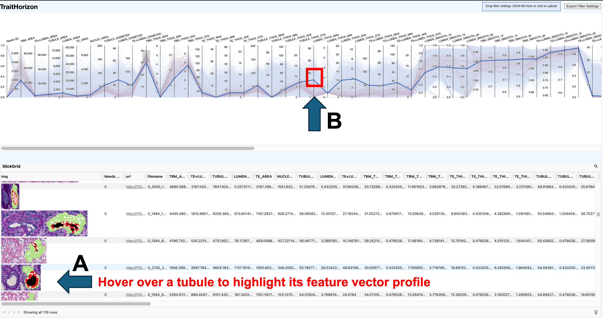
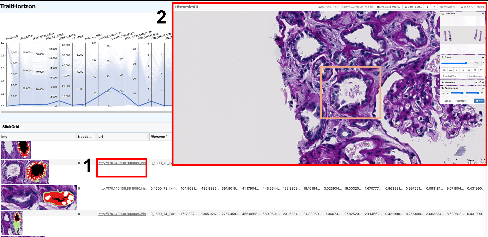
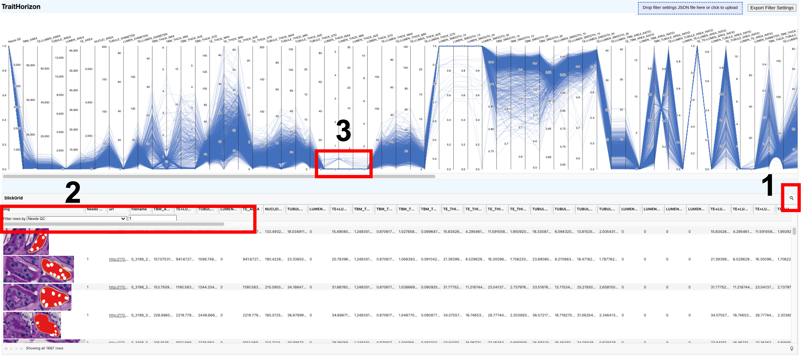

# Summary

Collections of Objects of Interest (OOIs)—such as cells, tubules, or tissue patches—paired with high-dimensional, computationally derived feature vectors are increasingly generated in image-based biomedical research. These OOI-feature datasets are routinely explored to detect outliers for quality control, uncover patterns, and generate biological insights. However, as datasets grow in size and complexity, researchers face bottlenecks: repeated manual creation of static visualizations for each subpopulation, difficulties efficiently plotting large numbers of high-dimensional feature vectors, and limited tooling for tracing individual feature values back to their source objects.

TraitHorizon is a browser-based visualization platform for interactive exploration of large OOI–feature pair datasets. It integrates three synchronized visualization components: (a) a parallel coordinates plot for feature-vector–level exploration, (b) dynamic violin plots for per-feature distribution analysis, and (c) a tabular data grid linking each feature vector to its corresponding object image. Its interactive interface enables real-time, scalable visualization of datasets containing hundreds of thousands of OOI-feature pairs. We demonstrate TraitHorizon's utility through a quality control case study involving 260,201 segmented kidney tubules, each characterized by 99 features, illustrating how the platform facilitates rapid, interpretable, and reproducible data interrogation.

TraitHorizon is publicly available at [https://traithorizon.com/](https://traithorizon.com/). The extended paper is available at [https://traithorizon.com/paper/paper_extended.pdf](https://traithorizon.com/paper/paper_extended.pdf).

# Statement of need

Research in computational imaging fields often aims to discover trends in OOIs associated with diagnosis, prognosis, and therapy response [@1; @2; @3]. From these objects, numerical feature vectors are extracted to encode their attributes, ranging from simple measures (e.g., area, texture) to deep learning-derived descriptors [@4; @5]. These features are typically examined using static visualizations such as parallel coordinates plots [@6] or scatter plots of dimensionally-reduced object representations (e.g., using UMAP [@7] or t-SNE [@8]), aided by summary statistics, to uncover structure and outliers. Multiple subpopulations often emerge, prompting repeated visualization and metric generation.

This workflow remains time-intensive due to three limiting factors. First, there is a **lack of connection** between an object's image, feature values, and cohort-level visualization. Discovering outliers or clusters prompts the need to trace them back to images, but static plots force analysts to manually map plotted points to objects. Second, **exploring subpopulations incurs high time cost**: manually plotting each subpopulation is inefficient, while programmatic approaches require subpopulations to be defined *a priori*. Dynamic filtering and responsive plots are needed for iterative exploration. Third, **rendering latency disrupts analysis** when datasets reach hundreds of thousands of data points. Browser-based tools not designed for this scale suffer from heavy memory utilization, latency, and unresponsiveness.

These factors motivate the development of interactive visualization tools that dynamically generate visualizations during exploration, seamlessly link plotted data to source images, and efficiently render at scale.

# State of the field

Several existing tools address parts of the interactive visualization problem but none fully satisfy all three requirements simultaneously. TensorBoard Projector [@9] and HoloViews [@10] support interactive plotting of large multivariate datasets but do not provide integrated image viewing linked to data points. DendroMap [@11] facilitates qualitative exploration of large image collections but does not link images back to their feature vectors or support dynamic filtering by feature value. HistoQC [@12] provides image-linked plots and quality metrics but is tailored specifically to whole-slide-level quality control in digital pathology, supporting only its predefined feature set rather than arbitrary user-defined feature vectors or object-level images.

TraitHorizon was built as a standalone tool rather than contributing to these existing projects for several reasons. First, no existing tool couples image display with high-dimensional feature visualization and interactive filtering in a single interface. Second, TraitHorizon's input format—a simple TSV file paired with an image directory—is deliberately generic, making it compatible with any upstream tool that outputs tabular data (e.g., HistoQC [@12], CohortFinder [@18]). Third, TraitHorizon's rendering pipeline was designed from the ground up for browser-based scalability to hundreds of thousands of objects, a requirement not addressed by the tools above.

# Software design

TraitHorizon is a Flask-based web application [@13], making it suitable for collaborative environments when hosted over a network. The front end leverages SlickGrid [@14], Parallel Coordinates (parcoords [@15]), and D3.js [@16] to power the interactive dashboard. Its command-line interface ingests a directory of object images (any browser-supported format [@17]) and a TSV file where each row contains an image filename followed by tab-separated feature columns. Integer, float, scientific notation, and categorical features are supported, along with an optional clickable URL column.

Key architectural decisions target scalability to datasets with hundreds of thousands of objects. (1) **Non-blocking progressive rendering** of the parallel coordinates plot keeps the interface responsive during rendering, completing in seconds to minutes depending on dataset size. (2) **Exportable filter configurations** allow parallel coordinate brush settings and filtered object IDs to be saved and restored via a lean JSON format without re-rendering. (3) **Infinite scrolling** in the data grid dynamically loads and replaces content within a fixed memory footprint. (4) **On-demand image loading** limits browser memory and network utilization. (5) **On-demand violin plot computation** avoids unnecessary CPU usage by computing distribution plots only when a user hovers over a parallel axis.

These design choices enable TraitHorizon to operate smoothly within browser constraints on consumer-grade hardware, regardless of dataset size.

# Use case

We demonstrate TraitHorizon using data from a digital pathology biomarker study [@2; @19]. The dataset comprises 260,201 segmented tubules and 99 associated pathomic features computed from 254 PAS-stained kidney biopsies from the NEPTUNE [@21; @22] and CureGN [@23] consortia.

After launching TraitHorizon (\autoref{fig:1}), we explored the parallel coordinates plot for a global view of feature distributions. Hovering over `TBM_THICK_MAX` (maximum tubular basement membrane thickness) revealed a strongly skewed distribution via the violin plot, suggesting extremal-value tubules requiring closer examination.

We filtered tubules with high `TBM_THICK_MAX` by brushing the corresponding axis (\autoref{fig:2}). The data grid revealed consistently thickened basement membranes (large green segments), a hallmark of tubular atrophy [@20; @24]. Hovering over individual rows highlighted their feature vectors in the parallel coordinates plot (\autoref{fig:3}), revealing a subpopulation exhibiting both thickened basement membranes and enlarged lumina. Applying a second brush on `LUMEN_THICK_MAX` (\autoref{fig:4}) isolated this composite phenotype, which pathologists confirmed as a distinct morphological pattern [@20].

TraitHorizon also supports exact-value search (\autoref{fig:6}), sorting features within the data grid (\autoref{fig:7}), and linking objects to external viewers via URL columns (\autoref{fig:5}). In our workflow, clicking a URL opened the corresponding tubule in HistomicsUI [@27] within the Digital Slide Archive [@28], enabling pathologists to assess tubules at every scale from the immediate tissue microenvironment to the whole slide context.

# Research impact statement

TraitHorizon has been directly used in two published studies investigating tubular pathomics in kidney disease. Fan et al. [@2] used TraitHorizon to perform quality control and exploratory analysis of 260,201 segmented tubules and 99 pathomic features, uncovering morphological patterns along a trajectory from normal to atrophic tubules that were subsequently validated by study pathologists and found to be clinically relevant. Ambekar et al. [@5] similarly used TraitHorizon for quality control of glomerular pathomic features in a study of minimal change disease and focal segmental glomerulosclerosis. In both studies, TraitHorizon enabled rapid identification of segmentation artifacts and biologically meaningful subpopulations that would have been impractical to discover using static visualization methods.

TraitHorizon is available as a Python package on PyPI and as a Docker image, providing straightforward installation across computing environments. Its simple TSV-plus-images input format is compatible with any upstream computational pipeline producing tabular features, and has already been used alongside HistoQC [@12] and CohortFinder [@18]. The tool is designed for broad applicability across computational imaging fields wherever researchers need to explore large collections of objects paired with high-dimensional feature vectors.

# AI usage disclosure

No generative AI tools were used in the development of the TraitHorizon software, its documentation, or the original manuscript. Claude Opus 4 (Anthropic) was used solely to assist with restructuring and condensing the manuscript to meet the updated JOSS format and word limit requirements. All AI-generated text was reviewed, edited, and validated by the human authors, who made all decisions regarding scientific content and framing.

# Acknowledgements

Research reported in this publication was supported by: 

(1) the National Institutes of Health (NIH) under the following awards: R01LM013864 and R01DK118431;  

(2) The Nephrotic Syndrome Study Network (NEPTUNE) is part of the Rare Diseases Clinical Research Network (RDCRN), which is funded by the NIH and led by the National Center for Advancing Translational Sciences (NCATS) through its Division of Rare Diseases Research Innovation (DRDRI). NEPTUNE is funded under grant number U54DK083912 as a collaboration between NCATS and the National Institute of Diabetes and Digestive and Kidney Diseases (NIDDK). Additional funding and/or programmatic support is provided by the University of Michigan, NephCure Kidney International, Alport Syndrome Foundation, and the Halpin Foundation. RDCRN consortia are supported by the RDCRN Data Management and Coordinating Center (DMCC), funded by NCATS and the National Institute of Neurological Disorders and Stroke (NINDS) under U2CTR002818; 

(3) Additional support was also provided by NephCure and the Henry E. Haller, Jr. Foundation; 

(4) Funding for the CureGN consortium is provided by U24DK100845, U01DK100846, U01DK100876, U01DK100866, and U01DK100867 from the National Institute of Diabetes and Digestive and Kidney Diseases (NIDDK). Patient recruitment is supported by NephCure. Dates of funding for first phase of CureGN was 9/16/2013-5/31/2019. Dates of funding for the second phase of CureGN was 6/1/2019 - 5/31/2024. 

NEPTUNE Collaborating Sites: Atrium Health Levine Children’s Hospital, Charlotte, SC: Susan Massengill*, Layla Lo#;Cleveland Clinic, Cleveland, OH: Katherine Dell*, John O’Toole*, John Sedor**, Victoria Grange#;Children’s Hospital, Denver, CO: Bradley Dixon*, Nathan Rogers#;Children’s Hospital, Los Angeles, CA: Rachel Lestz*, Natalie Esquivias#; Children’s Mercy Hospital, Kansas City, MO: Tarak Srivastava*, Kelsey Markus#; Cohen Children’s Hospital, New Hyde Park, NY: Christine Sethna*, Suzanne Vento#; Columbia University, New York, NY: Pietro Canetta*; Duke University Medical Center, Durham, NC: Opeyemi Olabisi*, Rasheed Gbadegesin**, Maurice Smith#; Emory University, Atlanta, GA: Laurence Greenbaum*, Chia-shi Wang*, Chris Fan#; The Lundquist Institute, Torrance, CA: Sharon Adler*, Janine LaPage#; John H Stroger Cook County Hospital, Chicago, IL: Amatur Amarah*; Johns Hopkins Medicine, Baltimore, MD: Meredith Atkinson*, Ryan Hutson#; Mayo Clinic, Rochester, MN: John Lieske, Marie Hogan, Fernando Fervenza; Medical University of South Carolina, Charleston, SC: David Selewski*, Cheryl Alston#; Montefiore Medical Center, Bronx, NY: Kim Reidy*, Michael Ross*, Frederick Kaskel**, Patricia Flynn#; New York University Medical Center, New York, NY: Laura Malaga-Dieguez*, Olga Zhdanova**, Laura Jane Pehrson#, Melanie Miranda#; The Ohio State University College of Medicine, Columbus, OH: Salem Almaani*, Laci Roberts#; Riley Children’s Hospital of Indiana University, Indianapolis, IN: Myda Khalid*, Veronica Servin#; Stanford University, Stanford, CA: Richard Lafayette*, Elizabeth Chen# ; Temple University, Philadelphia, PA: Iris Lee**; Texas Children’s Hospital at Baylor College of Medicine, Houston, TX: Shweta Shah*, Thinh Phan# ; University Health Network Toronto: Heather Reich*, Michelle Hladunewich**, Paul Ling#, Martin Romano#; University of California at San Diego, San Diego, CA: Ambarish Athavale*, Caitlin Carter*, Kristin Zeeb#; University of California at San Francisco, San Francisco, CA: Paul Brakeman*, Daniel Schrader; University of Colorado Anschutz Medical Campus, Aurora, CO: James Dylewski* Nathan Rogers#; University of Kansas Medical Center, Kansas City, KS: Ellen McCarthy*, Catherine Creed#; University of Miami, Miami, FL: Alessia Fornoni*, Miguel Bandes#; University of Michigan, Ann Arbor, MI: Matthias Kretzler*, Laura Mariani*, Zubin Modi*, Amanda Williams#, Roxy Ni#; University of Minnesota, Minneapolis, MN: Patrick Nachman*, Michelle Rheault*, Ariel Langenberger#, Brady Wallner#; University of North Carolina, Chapel Hill, NC: Vimal Derebail*, Keisha Gibson*, Anne Froment#, Sharia Warren#; University of Pennsylvania, Philadelphia, PA: Lawrence Holzman*, Kevin Meyers**, Krishna Kallem#, Arielle Swenson#; University of Texas San Antonio, San Antonio, TX: Samin Sharma**; University of Texas Southwestern, Dallas, TX: Elizabeth Roehm*, Kamalanathan Sambandam**, Elizabeth Brown**; University of Washington, Seattle, WA: Ashley Jefferson*, Sangeeta Hingorani**, Katherine Tuttle**§, Linda Manahan #, Emily Pao#, Kelli Kuykendall§; Wake Forest University Baptist Health, Winston-Salem, NC: Jen Jar Lin**; Washington University in St. Louis, St. Louis, MO: Brian Stotter*, Joseph Dumayas# 

Data Analysis and Coordinating Center: University of Michigan: Matthias Kretzler*, Brenda Gillespie**, Laura Mariani**, Zubin Modi**, Eloise Salmon**, Howard Trachtman**, Tina Mainieri, Michael Arbit, Hailey Desmond, Sean Eddy, Damian Fermin, Wenjun Ju, Maria Larkina, Chrysta Lienczewski, Rebecca Scherr, Jonathan Troost, Amanda Williams, Yan Zhai;; Cleveland Clinic: Crystal Gadegbeku**, John Sedor**, Duke University: Laura Barisoni**; Harvard University: Matthew G Sampson**; Northwestern University: Abigail Smith**; University of Pennsylvania: Lawrence Holzman**, Jarcy Zee** 

NEPTUNE Digital Pathology Committee: Carmen Avila-Casado (University Health Network), Serena Bagnasco (Johns Hopkins University), Lihong Bu (Mayo Clinic), Shelley Caltharp (Emory University), Clarissa Cassol (Arkana), Dawit Demeke (University of Michigan), Brenda Gillespie (University of Michigan), Jared Hassler (Temple University), Leal Herlitz (Cleveland Clinic), Stephen Hewitt (National Cancer Institute), Jeff Hodgin (University of Michigan), Danni Holanda (Arkana), Neeraja Kambham (Stanford University), Kevin Lemley, Laura Mariani (University of Michigan), Nidia Messias (Washington University), Alexei Mikhailov (Wake Forest), Vanessa Moreno (University of North Carolina), Behzad Najafian (University of Washington), Matthew Palmer (University of Pennsylvania), Avi Rosenberg (Johns Hopkins University), Virginie Royal (University of Montreal), Miroslav Sekulik (Columbia University), Barry Stokes (Columbia University), David Thomas (Duke University), Ming Wu (University of New York), Michifumi Yamashita (Cedar Sinai), Hong Yin (Emory University), Jarcy Zee (University of Pennsylvania), Yiqin Zuo (University of Miami). Co-Chairs: Laura Barisoni (Duke University), Cynthia Nast (Cedar Sinai) 

The CureGN Consortium members listed below, from within the four Participating Clinical Center networks and Data Coordinating Center, are acknowledged by the authors as Collaborators.  

**CureGN PCC Principal Investigators; *CureGN Site Principal Investigators; +CureGN Pathologists, #CureGN Lead Coordinators. 

CureGN Participating Clinical Centers (PCC) through Columbia University: Columbia University, New York, NY, US:  Gerald Appel, Revekka Babayev, Ibrahim Batal +, Andrew Bomback**, Pietro Canetta, Brenda Chan, Vivette Denise D'Agati +, Samitri Dogra, Hilda Fernandez, Gabriele Gaggero+, Ali Gharavi**, William Hines, , Krzysztof Kiryluk**, Satoru Kudose +, Fangming Lin, Victoria Kolupaeva#, Maddalena Marasa, Glen Markowitz +, Mariela Navarro-Torres, Hila Milo Rasouly, Sumit Mohan, Nicola Mongera, Jordan Nestor, Jai Radhakrishnan, Maya Rao, Maya Sabatello, Simone Sanna-Cherchi, Dominick Santoriello+, Miroslav Sekulic +, , Michael Barry Stokes+, Natalie Uy, Natalie Vena, Benjamin Wooden; University of Warsaw, Warszawa, Poland:  Bartosz Foroncewicz, Natalia Wiewiórska-Krata, Barbara Moszczuk, Krzysztof Mucha*, Agnieszka Perkowska-Ptasińska, Elżbieta Ryszkowska; IRCCS Giannina Gaslini, Genoa, Italy:  Francesca Lugani, Valerio Vellone+  

CureGN Participating Clinical Centers (PCC) through the Pediatric Nephrology Research Consortium: Children’s Hospital of New Orleans/ LSU Health, New Orleans, LA, USA:   Diego Aviles*; Children’s Mercy Hospital, Kansas City, MO, USA:  Tarak Srivastava*, Alexander Katz+; Children’s National Medical Center, Washington DC, USA:  Sun-Young Ahn*; Cincinnati Children’s Hospital Cincinnati, OH, USA:  Prasad Devarajan, Elif Erkan*, Hillarey Stone; Connecticut Children’s Medical Center, Hartford, CT, USA:  Sherene Mason*; East Carolina University Brody School of Medicine, Greenville, NC, USA:  Liliana Gomez-Mendez*; Emory University, Atlanta, GA, USA:  Larry Greenbaum**, Chia-shi Wang, Hong (Julie) Yin+ ; Helen DeVos Children’s Hospital, Grand Rapids, MI, USA:  Goebel Jens*; Levine Children’s Hospital/Atrium Health, Charlotte, NC, USA:  Donald Weaver*; Lurie Children’s Hospital, Chicago IL, USA:  Jill Krissberg*, Jerome Lane; Medical College of Wisconsin, Milwaukee, WI, USA:  Cindy Pan, Ellen Cody*; Nationwide Children’s Hospital, Columbus, OH, USA:  Samantha Martinek-Bundt#, Dawson Carmean#, Mary Dreher#, Mahmoud Kallash*, John Mahan**, Samantha Sharpe#, William Smoyer**, Laura Biederman+; Oregon Health and Science University, Portland, OR, USA:  Amira Al-Uzri*, Sandra Iragorri ; Riley Children’s Hospital, Indianapolis, IN, USA:  Myda Khalid**; Cardinal Glennon Children’s Medical Center/ St. Louis University, St. Louis, MO, USA:  Craig Belsha*; Texas Children’s Hospital, Houston, TX, USA:  Elizabeth Onugha*, Michael Braun, AC Gomez; Texas Tech Health Sciences Center, Amarillo, TX, USA:  Tetyana Vasylyeva*; Children’s of Alabama, University of Alabama, Birmingham, AL, USA:  Daniel Feig*; University of Colorado Children’s Hospital, Colorado, Aurora, CO, USA:  Melisha Hannah*; University of Kentucky, Lexington, KY, USA:  Aftab Chishti*; University of Louisville, Louisville, KY, USA:  Jon Klein**; Holtz Medical Center, University of Miami, Miami, FL, USA:  Chryso Katsoufis, Wacharee Seeherunvong*; University of Minnesota Children’s Hospital, Minneapolis, MN, USA:  Michelle Rheault**; University of New Mexico Health Sciences Center, Albuquerque, NM, USA:  Craig Wong*; University of Oklahoma Health Sciences Center, Oklahoma City, OK, USA:  Qassim Abid*; University of Virginia, Charlottesville, VA, USA:  John Barcia*, Agnes Swiatecka-Urban; University of Wisconsin, Madison, WI, USA:  Sharon Bartosh*; Washington University in St. Louis, St. Louis, MO, USA:  Brian Stotter*, Joseph Gaut + 

CureGN Participating Clinical Centers (PCC) through the University of North Carolina: Hôpital Maisonneuve-Rosemont, Montreal, Canada: Louis-Philippe Laurin*, Virginie Royal+, Mathieu Latour+, Natlie (Natacha) Patey +; Medical University of South Carolina, Charleston, SC, USA:  Anand Achanti, Milos Budisavljevic*, Vishwajeeth Pasham+; Northwestern University, Chicago, IL, USA:  Cybele Ghossein, Yonatan Peleg*; Ohio State University, Columbus, OH, USA:  Salem Almaani*, Isabelle Ayoub, Samir Parikh, Brad Rovin, Anjali Satoskar+; University of Chicago, Chicago, IL, USA:  Anthony Chang+ ; University of Alabama at Birmingham, Birmingham, AL, USA:  Huma Fatima+, Jan Novak, Matthew Renfrow, Dana Rizk*; University of North Carolina Kidney Center, Chapel Hill, NC, USA:  Dhruti Chen, Vimal Derebail**, Ronald Falk**, Keisha Gibson, Dorey Glenn, Susan Hogan, Koyal Jain, J. Charles Jennette+, Vanessa Moreno+, Amy Mottl, Caroline Poulton#, Monica Reynolds, Manish Kanti Saha, Nicole E. Wyatt; Vanderbilt University, Nashville, TN, USA:  Agnes Fogo+, Neil Sanghani*; Virginia Commonwealth University, Richmond, VA, USA: Jason Kidd*, Selvaraj Muthusamy+ 

CureGN Participating Clinical Centers (PCC) through the University of Pennsylvania: Children’s Hospital of Philadelphia, Philadelphia, PA, USA:  Rebecca Scobell*, Michelle Denburg, Amy Kogon, Kevin Meyers, Madhura Pradhan; Cleveland Clinic, Cleveland, OH, CA: Raed Bou Matar*, John O'Toole, John Sedor; Cohen Children’s Medical Center, New Hyde Park, NY, USA:  Christine Sethna**, Suzanne Vento#; Johns Hopkins University, Baltimore, MD, USA: Mohamed Atta, Serena Bagnasco+, Alicia Neu, John Sperati*; Lundquist Institute at Harbor-UCLA Medical Center, Torrance, CA, USA:  Sharon Adler*, Tiane Dai, Ram Dukkipati; Montefiore Medical Center, The Bronx, New York, NY, USA:  Frederick Kaskel, Kaye Brathwaite, Kimberly Reidy*; New York University, New York, NY, USA:  Laura Malaga-Dieguez*; Spokane Providence Medical Center, Spokane, WA, USA:  Katherine Tuttle*; Stanford University, Palo Alto, CA, USA:  Richard Lafayette*, Kamal Fahmeedah, Elizabeth Talley; Sunnybrook Health Sciences Centre, Toronto, Canada:  Michelle Hladunewich*; The Hospital for Sick Children, Toronto, Canada:  Rulan Parekh*; University Health Network, Toronto, Canada:  Carmen Avila-Casado+, Daniel Cattran*, Reich Heather, Meherzad Kutky ; University of Miami, Miami, FL, USA:  Yelena Drexler*, Alessia Fornoni; University of Michigan, Ann Arbor, MI, USA:  Jeffrey Hodgin+, Andrea Oliverio*; University of Pennsylvania, Philadelphia, PA, USA: Jon Hogan, Lawrence Holzman**, Matthew Palmer +, Gaia Coppock; University of Pittsburgh School of Medicine, Pittsburgh, PA, USA: Michael Mortiz, Juhi Kumar*; University of Washington, Seattle, WA, USA:  Charles Alpers+, J. Ashley Jefferson*; UT Southwestern, Dallas, TX, USA:  Kamal Sambandam, Bethany Roehm*Data Coordinating Center (DCC): Cedar Sinai Medical Center, Los Angeles, CA, USA: Cynthia Nast+, Jean Hou+; Duke University, Durham, NC, USA: Laura Barisoni; Cleveland Clinic, Cleveland, OH, USA: Crystal Gadegbeku**; Northwestern University, Chicago, IL, USA: Abigail Smith** ; University of Michigan, Ann Arbor, MI, USA: Brenda Gillespie, Bruce Robinson, Matthias Kretzler, Zubin Modi, Laura Mariani** 

Steering Committee Chair: Lisa M. Guay-Woodford, Children’s Hospital of Pennsylvania, Philadelphia, PA, USA 

# References
